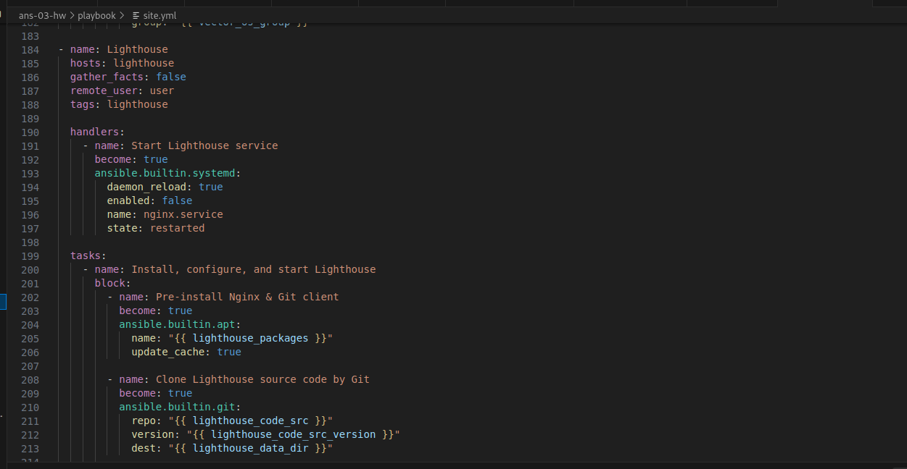

# Домашнее задание к занятию 3 «`Использование Ansible`» - `Живарев Игорь`

## Подготовка к выполнению

1. Подготовьте в Yandex Cloud три хоста: для `clickhouse`, для `vector` и для `lighthouse`.
2. Репозиторий LightHouse находится [по ссылке](https://github.com/VKCOM/lighthouse).

## Основная часть

1. Допишите playbook: нужно сделать ещё один play, который устанавливает и настраивает LightHouse.
2. При создании tasks рекомендую использовать модули: `get_url`, `template`, `yum`, `apt`.
3. Tasks должны: скачать статику LightHouse, установить Nginx или любой другой веб-сервер, настроить его конфиг для открытия LightHouse, запустить веб-сервер.
4. Подготовьте свой inventory-файл `prod.yml`.
5. Запустите `ansible-lint site.yml` и исправьте ошибки, если они есть.
6. Попробуйте запустить playbook на этом окружении с флагом `--check`.
7. Запустите playbook на `prod.yml` окружении с флагом `--diff`. Убедитесь, что изменения на системе произведены.
8. Повторно запустите playbook с флагом `--diff` и убедитесь, что playbook идемпотентен.
9. Подготовьте README.md-файл по своему playbook. В нём должно быть описано: что делает playbook, какие у него есть параметры и теги.
10. Готовый playbook выложите в свой репозиторий, поставьте тег `08-ansible-03-yandex` на фиксирующий коммит, в ответ предоставьте ссылку на него.

---

### Как оформить решение задания

Выполненное домашнее задание пришлите в виде ссылки на .md-файл в вашем репозитории.

---


## Ответ

1. Play, который устанавливает и настраивает LightHouse:



4. Inventory-файл `prod.yml`:


5. Запуск `ansible-lint site.yml`:


6. Запуск playbook с флагом `--check`:


7. Запуск playbook с флагом `--diff`:


```
╭─shaman@Barton ~/git/ans-03-hw/playbook 
╰─$ ansible-playbook -i inventory/prod.yml site.yml --diff
[WARNING]: Found both group and host with same name: clickhouse
[WARNING]: Found both group and host with same name: vector
[WARNING]: Found both group and host with same name: lighthouse

PLAY [Install Clickhouse, Vector & LightHouse] ************************************************************************************************************************************************

TASK [Gathering Facts] ************************************************************************************************************************************************************************
ok: [clickhouse]

TASK [Get clickhouse distrib] *****************************************************************************************************************************************************************
ok: [clickhouse] => (item=clickhouse-client)
ok: [clickhouse] => (item=clickhouse-server)
failed: [clickhouse] (item=clickhouse-common-static) => {"ansible_loop_var": "item", "changed": false, "dest": "./clickhouse-common-static-22.3.3.44.rpm", "elapsed": 0, "gid": 1000, "group": "igor", "item": "clickhouse-common-static", "mode": "0644", "msg": "Request failed", "owner": "igor", "response": "HTTP Error 404: Not Found", "secontext": "unconfined_u:object_r:user_home_t:s0", "size": 246310036, "state": "file", "status_code": 404, "uid": 1000, "url": "https://packages.clickhouse.com/rpm/stable/clickhouse-common-static-22.3.3.44.noarch.rpm"}

TASK [Get clickhouse distrib] *****************************************************************************************************************************************************************
ok: [clickhouse] => (item=clickhouse-client)
ok: [clickhouse] => (item=clickhouse-server)
ok: [clickhouse] => (item=clickhouse-common-static)

TASK [Install clickhouse packages] ************************************************************************************************************************************************************
ok: [clickhouse]

TASK [Flush handlers] *************************************************************************************************************************************************************************

TASK [Wait for clickhouse-server to become available] *****************************************************************************************************************************************
Pausing for 15 seconds (output is hidden)
(ctrl+C then 'C' = continue early, ctrl+C then 'A' = abort)
ok: [clickhouse]

TASK [Create database] ************************************************************************************************************************************************************************
ok: [clickhouse]
Inconsistency detected by ld.so: dl-open.c: 560: dl_open_worker: Assertion `_dl_debug_initialize (0, args->nsid)->r_state == RT_CONSISTENT' failed!

PLAY [Vector] *********************************************************************************************************************************************************************************

TASK [Create vector work directory] ***********************************************************************************************************************************************************
ok: [vector]

TASK [Get Vector distrib] *********************************************************************************************************************************************************************
ok: [vector]

TASK [Unzip Vector archive] *******************************************************************************************************************************************************************
ok: [vector]

TASK [Install Vector binary] ******************************************************************************************************************************************************************
ok: [vector]

TASK [Check Vector installation] **************************************************************************************************************************************************************
changed: [vector]

TASK [Create Vector config vector.toml] *******************************************************************************************************************************************************
ok: [vector]

TASK [Create vector.service daemon] ***********************************************************************************************************************************************************
changed: [vector]

TASK [Modify vector.service file] *************************************************************************************************************************************************************
--- before: /lib/systemd/system/vector.service
+++ after: /lib/systemd/system/vector.service
@@ -8,7 +8,7 @@
 User=vector
 Group=vector
 ExecStartPre=/usr/bin/vector validate
-ExecStart=/usr/bin/vector
+ExecStart=/usr/bin/vector --config /etc/vector/vector.toml
 ExecReload=/usr/bin/vector validate
 ExecReload=/bin/kill -HUP $MAINPID
 Restart=no

changed: [vector]

TASK [Create user vector] *********************************************************************************************************************************************************************
ok: [vector]

TASK [Create Vector data_dir] *****************************************************************************************************************************************************************
ok: [vector]

RUNNING HANDLER [Start Vector service] ********************************************************************************************************************************************************
changed: [vector]

PLAY [Lighthouse] *****************************************************************************************************************************************************************************

TASK [Pre-install Nginx & Git client] *********************************************************************************************************************************************************
ok: [lighthouse]

TASK [Clone Lighthouse source code by Git] ****************************************************************************************************************************************************
ok: [lighthouse]

TASK [Prepare nginx config] *******************************************************************************************************************************************************************
ok: [lighthouse]

PLAY RECAP ************************************************************************************************************************************************************************************
clickhouse                 : ok=5    changed=0    unreachable=0    failed=0    skipped=0    rescued=1    ignored=0   
lighthouse                 : ok=3    changed=0    unreachable=0    failed=0    skipped=0    rescued=0    ignored=0   
vector                     : ok=11   changed=4    unreachable=0    failed=0    skipped=0    rescued=0    ignored=0   

╭─shaman@Barton ~/git/ans-03-hw/playbook 
╰─$ 
```
